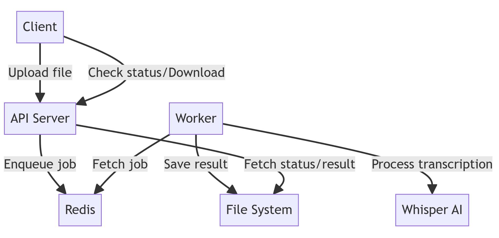

# Transcription service
This project extracts text transcriptions from movies and audio recordings in most popular video formats.


## Capabilities

- Supports transcription of both popular video and audio formats
- Should be able to handle long videos (up to several hours)
- Scalable architecture using Redis (with the extension of Redis Queue) for job queuing and worker management
- Self-hosted solution using open-source Whisper AI model
- RESTful API for file upload and transcription status checking
- Separate worker processes for handling transcription tasks
- Everything is containerized using Docker and Docker Compose, including cuda support setup
- Option to include word timestamps in transcriptions

## Architecture
The service consists of the following components:
- API Server: Handles incoming requests and manages the transcription queue.
- Redis: Acts as a message broker and job queue.
- Worker: Processes transcription jobs using the Whisper AI model.



## Running the containerized service
### Prerequisites

- Docker and Docker Compose
- NVIDIA GPU with CUDA support (optional, for GPU acceleration)
- NVIDIA drivers and NVIDIA Container Runtime installed on the host system (optional, for GPU acceleration)

### Installation and setup (containerized)

1. Clone this repository:
   ```bash
   git clone <org_path>/transcription_service.git
   cd transcription_service
2. To access hugging face models for speaker diarization, you need to:
   - request access to these models (they are released under MIT license):
      - [pyannote/speaker-diarization](https://hf.co/pyannote/speaker-diarization)
      - [pyannote/segmentation](https://hf.co/pyannote/segmentation)
   - [create Hugging Face token](https://hf.co/settings/tokens) and put it in project root directory in `.env` file as `HF_TOKEN`
3. The environment variables are already set in the docker-compose.yml file. If you need to modify any settings, you can do so directly in the compose file or by creating a .env file in the project root directory.
4. Build and start the services using Docker Compose:
    ```bash
    docker-compose up --build
    ```

### Configuration
Configuration of different service components can be found in Docker Compose file under `docker/docker-compose.yml`.

#### Environment variables
The following environment variables are configured in the docker-compose.yml file:

- **REDIS_HOST**: Hostname of the Redis server (set to redis unless one wants to use a different/external Redis server)
- **REDIS_PORT**: Port of the Redis server (set to 6379)
- **REDIS_DB**: Number of Redis database used for tasks/jobs orchestration (defaults to 10)
- **UPLOADS_DIR:** Directory for uploaded files (defaults to /app/uploads, and the directory can be accessed from the volume)
- **TRANSCRIPTIONS_DIR**: Directory for storing transcriptions (set to /app/transcriptions, and the directory can be accessed from the volume)
- **WHISPER_MODEL_NAME**: Whisper model to use (defaults to large-v3 with best quality, see alternative models in resource-scare scenarios)
- **WHISPER_MODEL_DEVICE**: Device to run the whisper model on (set to cuda for GPU acceleration)
- **DIARIZATION_MODEL_DEVICE**: Device to run the diarization model on (set to cuda for GPU acceleration)

#### GPU support
GPU support is enabled by default in the Docker Compose configuration. To use it:

1. Ensure your host system has NVIDIA drivers and NVIDIA Container Runtime installed.
2. The docker-compose.yml file already includes the necessary configuration:
```yaml
deploy:
  resources:
    reservations:
      devices:
        - driver: nvidia
          count: all
          capabilities: [ gpu ]
runtime: nvidia 
```

#### Scaling workers
To scale the number of worker processes horizontally:

1. Use Docker Compose's --scale option:
```bash
docker-compose up --scale worker=3
```
This command will start 3 worker containers, you can use whatever number you see fit.

2. Alternatively, you can modify the docker-compose.yml file to include a deploy section for the worker service:
```yaml
worker:
  # ... other configurations ...
  deploy:
    replicas: 3
```
Then run docker-compose up --build to apply the changes.

**IMPORTANT**: Make sure to adjust the number of workers based on the available resources on your host system – especially when using GPU acceleration.

#### Whisper Model Configuration
By default, the service uses the large-v3 Whisper model, which requires approximately 10-11GB of GPU memory (VRAM). 
You can choose different models based on your hardware capabilities – with smaller options such as `tiny` or `base`
requiring much less resources and working very fast even on just CPUs – but providing lower transcription quality.

For a full list of available models and their capabilities, visit: https://github.com/openai/whisper?tab=readme-ov-file#available-models-and-languages
To change the model, update the WHISPER_MODEL_NAME environment variable in the docker-compose.yml file under the worker service.
**Note: Models are not embedded in the worker images and are downloaded at runtime.**

## Running the service locally/development setup

For local development follow the steps below:
1. Clone this repository:
   ```bash
   git clone <org_path>/transcription_service.git
   cd transcription_service
2. Create a virtual environment and install dependencies (poetry must be installed in the system already):
   ```bash
   poetry install
   ```
3. Set up pre-commit hooks (pre-commit must be installed in the system already):
   ```bash
   pre-commit install
   ```
4. Start the service using Uvicorn:
   ```bash
   uvicorn transcription_service.main:app --reload --env-file=.example.env
   ```

Workers should be able to be started with a similar fashion, using the following command:
```bash
python -m transcription_service.worker
```

Redis server should be running on the default port (6379) on localhost.

## Testing and usage

To run the end-to-end transcription workflow, you can use the provided utility script:
```bash
python scripts/end_to_end_transcription.py
```
This script uploads a sample video file to the service, checks the transcription status, 
and downloads the transcription once it's ready.

Note: ensure the service is running before executing the script + you're running it from virtual environment with
all dependencies installed.

### Call with example arguments
```bash
python scripts/end_to_end_transcription.py localhost:8001 https://www.youtube.com/watch?v=TX4s0X6FDcQ /path/to/local/sandbox/outputs/TX4s0X6FDcQ_transcription.txt --include-word-timestamps
```
The call above will upload the video to the service running at localhost:8001 from the provided YouTube link (we 
support both paths to local files, and YT links for convenience, as it was a popular internal use case), check
the transcription status, and download the transcription once it's ready to path specified. 
The `--include-word-timestamps` flag is responsible for setting the generated transcription to "rich" format
which will include word timestamps in the transcription.

### Swagger API documentation
All endpoints are documented using Swagger UI, which can be accessed at http://localhost:8001/docs.

## TODOs
Future (possible) improvements:
- Add configurable file size restrictions for uploads and video lengths to manage system resources effectively.
- Implement user authentication and authorization for secure access to the API.
- Add support for other TTS models than Whisper (it was prioritized due to being SOTA).

## License

Extracted from a larger system, this component was brought to you by 🐰 [datarabbit.ai](https://www.datarabbit.ai/) 🐰

It is licenced under the Apache License, Version 2.0. in order to allow for the flexibility of use and modification.

Do something cool with it! 🚀
